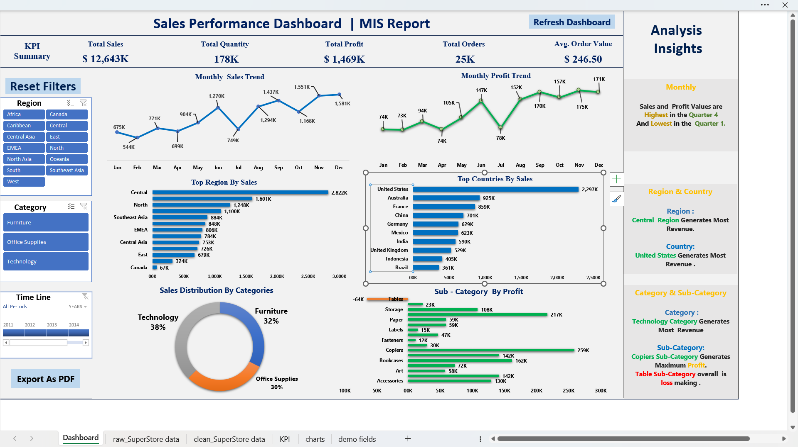

# 📊 Automated Sales MIS Dashboard using Excel

---

## 📌 Project Overview

This project presents an interactive **Sales MIS Dashboard** built in Microsoft Excel to analyze business performance across multiple dimensions including time, geography, and product categories.

The dashboard is designed to support decision-making by providing clear insights and an efficient reporting mechanism.

---

## 🧰 Tools & Technologies Used

* Microsoft Excel
* Pivot Tables & Pivot Charts
* Slicers & Timeline Filters
* Excel Formulas
* VBA Macros (Automation)

---

## 📊 What I Did in This Project

* Cleaned and transformed raw sales data for analysis
* Created additional calculated fields such as Month and Year
* Built KPI metrics including Total Sales, Profit, Orders, Quantity, and Average Order Value
* Designed an interactive dashboard using Pivot Tables and charts
* Performed time-based analysis to identify monthly trends and seasonality
* Analyzed sales performance across regions, countries, categories, and sub-categories
* Identified key business insights such as top-performing regions and loss-making areas
* Implemented automation using VBA macros:

  * Refresh dashboard
  * Reset filters (including timeline slicer)
  * Export dashboard as PDF
* Designed a clean and user-friendly layout with slicers for dynamic filtering

---

## 📈 Key Insights

* Sales and profit peak during **Quarter 4 (Oct–Dec)**
* **United States** generates the highest revenue
* **Technology category** contributes the most to overall sales
* **Copiers sub-category** generates the highest profit
* **Tables sub-category** is overall loss-making

---

## ⚙️ Reporting & Automation

This project simulates a real-world MIS reporting workflow where dashboards are used to generate and share business reports.

Key features include:

* One-click dashboard refresh using macros
* Reset filters functionality for consistent reporting
* Export dashboard as PDF for sharing with stakeholders
* Structured layout for easy interpretation
* Insights panel summarizing key findings

---

## 💼 Business Use Case

This dashboard can be used by business managers and MIS executives to:

* Monitor sales and profit performance
* Identify high-performing regions and products
* Detect loss-making areas
* Generate reports for decision-making

---

## 📁 File Structure

The Excel file contains multiple sheets organized as follows:

* **raw_SuperStore data** → Original dataset
* **clean_SuperStore data** → Cleaned dataset used for analysis
* **added cols** → Derived columns (Month, Year, etc.)
* **KPI** → KPI calculations
* **charts** → Pivot tables and charts
* **Dashboard** → Final interactive dashboard

---

## 📸 Dashboard Preview

---

## 🚀 How to Use

1. Open the Excel file
2. Use slicers to filter data dynamically
3. Click **Refresh Dashboard** to update data
4. Click **Reset Filters** to clear selections
5. Click **Export Report** to generate a PDF

---

## 🧠 Skills Demonstrated

* Data Cleaning & Preparation
* Excel Pivot Tables & Charts
* Dashboard Design & Visualization
* Business Analysis & Insight Generation
* Excel Automation (VBA Macros)
* Reporting & Presentation Skills

---

Interactive Sales MIS Dashboard built using Excel with automation, KPI tracking, and business insight.
